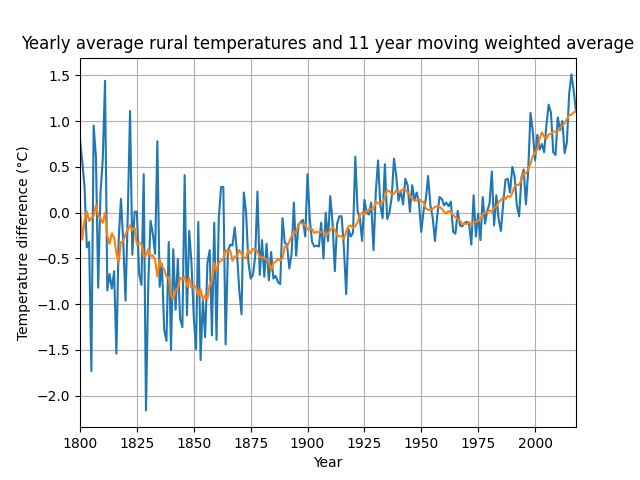

Climate: The Movie includes a graph attributed to Soon et al. 2023 (https://www.mdpi.com/2225-1154/11/9/179?mc_cid=108c6fb6fc)
As pointed out by potholer54 in his debate (https://www.youtube.com/watch?v=UaZuEl2hu9M) with the movie's producer, Tom Nelson, the graph in the movie does not accurately reflect Soon's paper.
Rather than take 30 minutes to download the freely and easily available data (https://zenodo.org/records/7088728) and plot a moving average, Tom Nelson seems to have taken "artistic liberties" with the data.
Contrary to what Nelson claims, an upward temperature trend, as well as a significant temperature difference between the 40s and today, can be seen.

